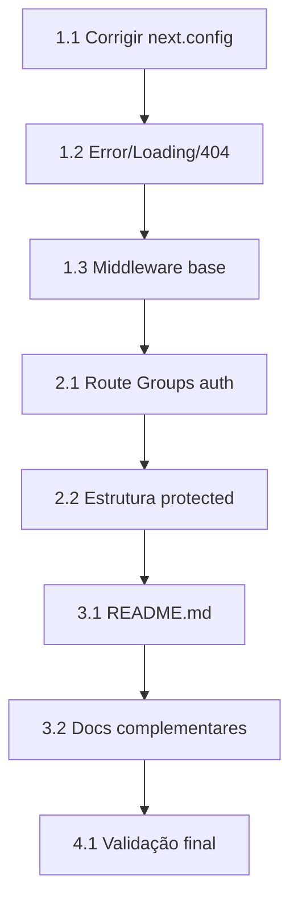

# Plano de Melhorias - Arquitetura de Rotas Web-AMO

## 📋 Contexto

O projeto **Web-AMO** é uma plataforma de apoio ao ensino acadêmico construída com Next.js 16 e React 19. Atualmente possui uma estrutura de rotas muito básica (apenas `/` e `/cadastro`), sem tratamento de erros, estados de loading, middleware de proteção ou documentação.

## 🎯 Objetivos

1. **Boas Práticas**: Implementar padrões recomendados pelo Next.js
2. **Manutenibilidade**: Estrutura escalável e organizada por domínios
3. **Documentação**: README completo para onboarding de desenvolvedores
4. **Resiliência**: Tratamento adequado de erros e estados de carregamento
5. **Segurança**: Preparar estrutura para autenticação futura

---

## 🏗️ Arquitetura Proposta

```
app/
├── (auth)/                      # Route Group - Rotas públicas
│   ├── layout.tsx               # Layout centralizado para auth
│   ├── page.tsx                 # Login (/)
│   └── cadastro/
│       └── page.tsx             # Cadastro (/cadastro)
│
├── (protected)/                 # Route Group - Rotas protegidas (futuro)
│   ├── layout.tsx               # Layout com navegação
│   └── dashboard/
│       └── page.tsx             # Dashboard (/dashboard)
│
├── layout.tsx                   # Root Layout
├── loading.tsx                  # Loading global
├── error.tsx                    # Error boundary global
├── not-found.tsx                # Página 404
└── globals.css
```

---

## ✅ Tarefas

### Fase 1: Fundação (Prioridade Alta)

#### 1.1 Remover configurações problemáticas
- [x] Remover `ignoreBuildErrors: true` do `next.config.mjs`
- [x] Verificar e corrigir erros TypeScript existentes

#### 1.2 Tratamento de Erros e Loading
- [x] Criar `app/error.tsx` - Error boundary global
- [x] Criar `app/not-found.tsx` - Página 404 personalizada
- [x] Criar `app/loading.tsx` - Estado de loading global

#### 1.3 Middleware Base
- [x] Criar `middleware.ts` na raiz do projeto
- [x] Configurar estrutura base para proteção de rotas (preparação futura)

### Fase 2: Reorganização (Prioridade Média)

#### 2.1 Route Groups
- [ ] Criar Route Group `(auth)` para rotas públicas de autenticação
- [ ] Mover `page.tsx` (login) para `(auth)/page.tsx`
- [ ] Mover `cadastro/page.tsx` para `(auth)/cadastro/page.tsx`
- [ ] Criar `(auth)/layout.tsx` específico para páginas de autenticação

#### 2.2 Preparar Estrutura Protegida
- [ ] Criar Route Group `(protected)` para rotas privadas futuras
- [ ] Criar `(protected)/layout.tsx` base
- [ ] Criar placeholder `(protected)/dashboard/page.tsx`

### Fase 3: Documentação (Prioridade Alta)

#### 3.1 README Principal
- [x] Criar `README.md` com:
  - Descrição do projeto
  - Tecnologias utilizadas
  - Requisitos de instalação
  - Como executar o projeto
  - Estrutura de pastas
  - Arquitetura de rotas
  - Convenções de código
  - Guia de contribuição

#### 3.2 Documentação Complementar
- [x] Criar `docs/ARCHITECTURE.md` - Detalhes da arquitetura
- [x] Criar `docs/CONTRIBUTING.md` - Guia de contribuição

### Fase 4: Qualidade (Prioridade Média)

#### 4.1 Consistência de Código
- [ ] Verificar se há erros de lint (`npm run lint`)
- [ ] Garantir build sem erros (`npm run build`)

---

## 📁 Arquivos a Serem Criados

| Arquivo | Descrição |
|---------|-----------|
| `app/error.tsx` | Error boundary com UI amigável |
| `app/not-found.tsx` | Página 404 personalizada |
| `app/loading.tsx` | Skeleton/Spinner global |
| `proxy.ts` | Proxy base do Next.js (proteção de rotas) |
| `app/(auth)/layout.tsx` | Layout específico para auth |
| `app/(auth)/page.tsx` | Login (movido) |
| `app/(auth)/cadastro/page.tsx` | Cadastro (movido) |
| `app/(protected)/layout.tsx` | Layout para rotas protegidas |
| `app/(protected)/dashboard/page.tsx` | Dashboard placeholder |
| `README.md` | Documentação principal |
| `docs/ARCHITECTURE.md` | Documentação de arquitetura |
| `docs/CONTRIBUTING.md` | Guia de contribuição |

---

## 🔄 Ordem de Execução



---

## ⚠️ Considerações

1. **Não quebrar funcionalidade existente**: As URLs `/` e `/cadastro` devem continuar funcionando
2. **Route Groups não afetam URLs**: `(auth)` e `(protected)` são apenas organizacionais
3. **Middleware preparatório**: Inicialmente sem lógica de autenticação real (a ser implementada com backend)
4. **Componentes existentes**: `components/amo/` permanecem intactos

---

## 📊 Métricas de Sucesso

- [ ] Build passa sem erros (`npm run build`)
- [ ] Lint passa sem erros (`npm run lint`)
- [ ] Rotas `/` e `/cadastro` funcionam normalmente
- [ ] Página 404 aparece para rotas inexistentes
- [ ] README completo e informativo
- [ ] Estrutura preparada para escalar

---

## 🕐 Estimativa

| Fase | Complexidade |
|------|-------------|
| Fase 1 - Fundação | Baixa |
| Fase 2 - Reorganização | Média |
| Fase 3 - Documentação | Baixa |
| Fase 4 - Qualidade | Baixa |

---

## 📝 Notas

- O projeto usa shadcn/ui + Radix UI para componentes
- Tailwind CSS v4 está configurado
- React Hook Form + Zod para formulários
- Analytics do Vercel já integrado
